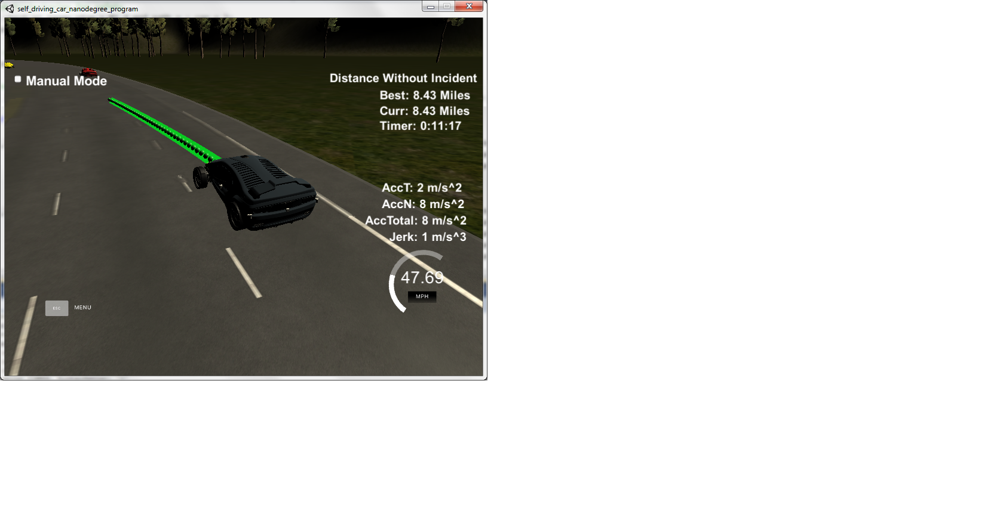

# **Path Planning** 

**Path Planning Project**

The goals / steps of this project are the following:
* Implement a Vehicle Highway Path Planner based on the theory taught in lessons 2-5
* Tune the implementation such that the car drives fast but safe and is able to change lanes
* Summarize the results with a written report

[//]: # (Image References)

[screenshot]:   ./PathPlanning.png   "Path Planning Screenshot"

## Rubric Points

Here I will consider the [rubric points](https://review.udacity.com/#!/rubrics/1020/view) individually and describe how I addressed each point in my implementation.  

## Implementation of the Path Planner

My implementation followed pretty much the suggestions made in the "Project Walkthrough and Q&A" video of the Path Planning Project lesson. The different aspects are discussed in the next sections. The code is structured in general as follows: `constants.hpp` and `constants.cpp` contain some definition of constants, such as, e.g., number of lanes, lane width, time increment. `math_helper.hpp` and `math_helper.cpp` contain some helper functions for coordinate transformations or distance calculation. `trajectory_helper.hpp` and `trajectory_helper.cpp` contain a helper function to check lanes for safety based on input vehicle state and sensor fusion data. `spline.h` is the 3rd party spline library suggested for the project and downloaded from [http://kluge.in-chemnitz.de/opensource/spline/](http://kluge.in-chemnitz.de/opensource/spline/). Finally, `main.cpp` contains the implementation of the path planning cycle.

#### Lane following

To follow the lanes, I first use Frenet coordinates to define where the vehicle is supposed to be in 30 meters, 60 meters and 90 meters (based on current vehicle Frenet coordinate s and choice of lane). (See lines 276-284 of `main.cpp`.) Then I transform to the world Carthesian coordinate system and interpolate a spline through the last previously planned state of the vehicle (including heading information) and the points of the current planning step. (See lines 286-299 of `main.cpp`.) Along this spline, I select the next points based on the currently planned speed. (See lines 315-340 of `main.cpp`.) As planning horizon I use 50 points. With a time increment of 0.02 seconds this results in a planning horizon of 1 second. Also, the previously planned points, which are not passed yet, are reused to ensure continuity in the driving trajectory. (See lines 307-311 of `main.cpp`.)

#### Speed control

To control the speed, I use the simple logic suggested in the video: If continuing at the same speed (or higher) is not safe on the current lane or the planned lane, then reduce the planned speed. Otherwise, if the current speed is less than the desired speed of 50 miles per hour, increase the planned speed. (See lines 224-233 of `main.cpp`.)

#### Lane changing

The lane changing behavior is based on considerations of safe lanes (see `trajectory_helper.hpp` and `trajectory_helper.cpp`), where a lane is considered safe if there is no other vehicle within a safe distance. Here, the safe distance is based on the German rule of thumb "halber Tacho" (i.e., "half speedometer"), which says that the distance in meters to the next vehicle ahead should be at least half of the currently driven speed in kilometers per hour.

If both the currently driven and the currently planned lane (which might be identical) are safe then no change in plan is required. (See lines 132-150 of `main.cpp`.) If they are not safe, first all transistions to adjacent lanes are checked for safety, then also all transitions through adjacent lanes to far lanes. (See lines 153-221 of `main.cpp`.) The best safe lane transition (where best means maximum free distance to the front) is used as a plan. Otherwise, the vehicle will stick to its current plan and reduce the speed. A resulting lane change can be seen in below screenshot of the simulator: .

#### Discussion

There are several possible improvements of the implemented simple approach. The most important ones would be to incorporate an analysis of the behavior of the other cars (e.g., analyze whether another car is changing lanes), to consider replanning of previously planned trajectory in emergency situations, and to implement reasonable behavior for situations in which the current algorithm detects the situation as "not safe" (the current algorithm will just stick to its plan). Further possibilities of improvement include tweaking of parameters to change lanes more aggressively (but still safely).